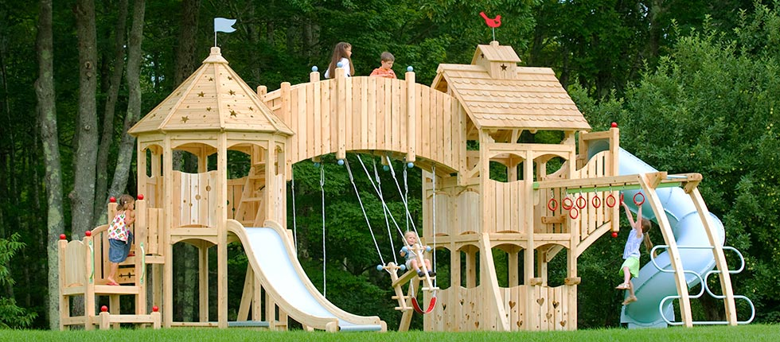

## Do you remember our swing set?

### Wasn't it <b>wonderful</b>?

---

## What are the costs of egg production?

1. <b>Financial</b>
  - Set up costs?
  - How much feed required to produce an egg?
2. <b>Environmental</b>
  - How much land required to produce the feed?
  - What are the emissions?
  - What is the waste?
3. <b>Emotional</b>
  - We lost a good swing set.

---

## Background

- There are <u>4 chickens</u>
- They were leeching off us for <u>4 months</u>
- Laid one egg per chicken per day for the last <u>3 months</u>

---

## Setup costs (according to the Fathership)

- Infrastructure
  - Coop £129
  - Compound perimeter (phase 1) £189
      - <i>Fencing</i>
  - Compound perimeter (phase 2) £120
      - <i>Escape sirens and roaming spotlights</i>
  - Compound perimeter (phase 3) £70
      - <i>Two manned sentry towers</i>
  - Misc £100
  - <b>TOTAL: £610</b>

---

## Setup costs (according to the **Mothership**)

- Infrastructure
  - <b>EK HAZAAR PUND</b>

---

## Setup costs

- Feed during development (when no eggs were produced)
  - 20kg of the 50kg used in the first 7 months (1.25kg per chicken per month)
  - <b>TOTAL: £10</b>

Averaging the estimates for the infrastructure gives a financial setup cost of
- <b>£815</b>

---

## Cost to produce one egg

The chickens eat 
- Chicken feed
- Kitchen waste
- Insects and things in the garden

The chicken feed has a <b>direct cost</b>, the kitchen waste has <b>no cost</b>, and removing insects from the garden may have some <b>indirect costs</b> (or benefits) that are difficult to quantify

---

## Cost to produce one egg (feed)

Price for feed for each chicken per day is based on
- £10 per 20kg bag
- Consumption of one bag over two months
- For 4 chickens

After some algebra:
- 4p per day per chicken for feed alone.

---

## Cost to produce one egg (setup costs)

We have to account for the setup costs.

Additional price for one egg with setup costs distributed over <u>6 years</u>
- £810 / (365 * 6 years * 4 chickens) = 9p

---

## Cost to produce one egg

Assuming each chicken lays one egg a day

### Total cost to produce one egg 
- 13p

### Cost of one free range egg from ASDA from a pack of 12 
- 23p

---

## How long to write-off setup costs?

Need to make £810 profit
- with a saving of 19p per egg

810 / 0.19 / 4 = 1065 days = 2.9 years

---

## Environmental costs

- How much land required to produce an egg
- How much CO2 to produce an egg

---

## Let's assume that their feed is just wheat

According to a recent US government report on average one acre of land can produce
- 26 bushels of wheat

After consulting the Bible, it turns out that a bushel is about 50 pounds of wheat, or 590kg per acre.
- Our chickens are eating 83g a day <b>each</b>
- 4 chickens eat 121kg of feed per year in total

## One fifth of an acre per year

---

## How much CO2 for the wheat?

- 0.4kg CO2-e per 1kg wheat
- 121kg CO2-e per year
- 82g CO2 per egg

By comparison, it is about 5

